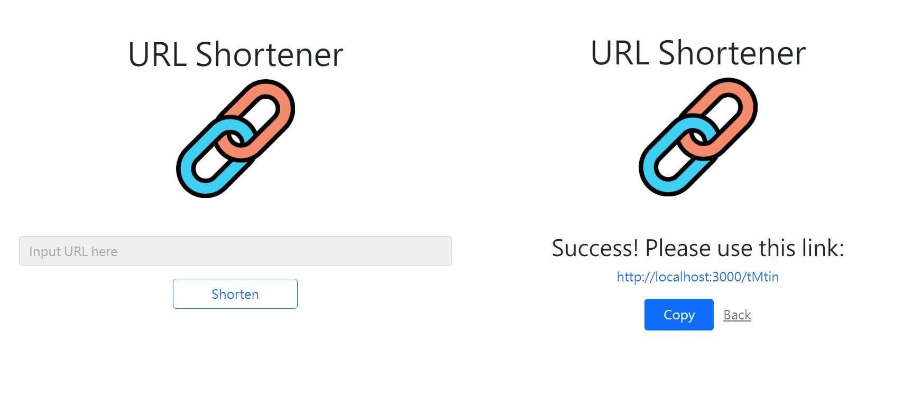

# 短網址產生器
可以將長網址轉換成短網址的產生器



## 功能
* 輸入網址點擊Shorten按鈕後會得到縮短後的網址
* 輸入過的網址再點擊會得到相同的短網址
* 可藉由Copy按鈕複製短網址
* 可以經由短網址連結至原本網址

## 開始使用
1. 請先確認已安裝 node.js 與 npm (版本請見下方開發工具)
2. 經由終端機clone或下載本專案至本地資料夾
  ```
  https://github.com/Noelle-KH/url-shortener.git
  ```
3. 於終端機進入存放本專案的資料夾
  ```
  cd url-shortener
  ```
4. 安裝 npm 套件
  ```
  npm install
  ```

5. 新增```.env```檔案，並設置資料庫連線字串
  ```
  MONGODB_URL=mongodb+srv://<account>:<password>@cluster0.<xxxxx>.mongodb.net/<table>?retryWrites=true&w=majority
  ```
6. 啟動專案前，可以建立種子資料，如在終端機中成功看到done，即表示種子資料建立成功(可略過步驟)
  ```
  npm run seed
  ```
7. 欲啟動專案，請繼續輸入
  ```
  npm run dev
  ```
8. 若在終端機看到下方訊息代表順利運行，於瀏覽器中輸入該網址([http://localhost:3000](http://localhost:3000))即可開始使用本網站
  ```
  Listening on http://localhost:3000
  ```
9. 如需暫停使用，請於終端機內按下ctrl + c，即可結束


## 開發工具
* Node.js 16.17.1
* Express 4.18.2
* Express-Handlebars 6.0.6
* Mongoose 6.7.2
* dotenv 16.0.3
* Bootstrap 5.1.3